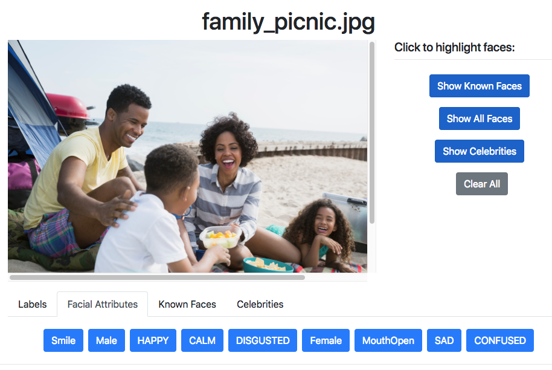

# Builders Session - Label stock images using Rekognition
Welcome to the builder's session on creating labels on stock images using Amazon Rekognition and AWS Lambda. The solution, a Node.js implementation is a modified version of [Media Analysis Solution](https://aws.amazon.com/answers/media-entertainment/media-analysis-solution/); a serverless reference implementation to extract metadata from media files. The solution extracts metadata from images, and store resulting metadata for future search and analysis.

## Solution Architecture


1. When new images are uploaded to the Amazon Simple Storage Service (Amazon S3) media analysis bucket, an AWS Lambda function invokes the AWS Step Functions state machine. Metadata is extracted by Amazon Rekognition.

2. Another Lambda function retrieves, processes, and stores the results in the Amazon S3 bucket and an Amazon Elasticsearch cluster. The resulting metadata can be authenticated, securely searched, and retrieved using Amazon Cognito and an Amazon API Gateway RESTful API.  

3. The solution also deploys a static Amazon S3 web interface that customers can use to immediately start uploading, analyzing, and interacting with small media files.  

## Deploy Media Analysis Solution using CloudFormation Stack

1. Click on one of the buttons below to launch CloudFormation stack one of the AWS regions.

Region| Launch
------|-----
US East (N. Virginia) | [](https://console.aws.amazon.com/cloudformation/home?region=us-east-1#/stacks/new?stackName=MediaAnalysis&templateURL=https://s3.amazonaws.com/reinvent-media-analysis-workshop/media-analysis-deploy-v1.template.yaml)
US East (Ohio) | [](https://console.aws.amazon.com/cloudformation/home?region=us-east-2#/stacks/new?stackName=MediaAnalysis&templateURL=https://s3.amazonaws.com/reinvent-media-analysis-workshop/media-analysis-deploy-v1.template.yaml)
US West (Oregon) | [](https://console.aws.amazon.com/cloudformation/home?region=us-west-2#/stacks/new?stackName=MediaAnalysis&templateURL=https://s3.amazonaws.com/reinvent-media-analysis-workshop/media-analysis-deploy-v1.template.yaml)
EU (Ireland) | [](https://console.aws.amazon.com/cloudformation/home?region=eu-west-1#/stacks/new?stackName=MediaAnalysis&templateURL=https://s3.amazonaws.com/reinvent-media-analysis-workshop/media-analysis-deploy-v1.template.yaml)

2. Click **Next** on the Select Template page.

3. Enter a **valid email address**. You will receive log-in information and notifications at this email address after the CloudFormation template is complete. Leave the Elasticsearch cluster size to be **Small** and click **Next**.

    

4. On the Options page, leave all the defaults and click **Next**.

5. On the Review page, check the box to acknowledge that CloudFormation will create IAM resources and click **Create**.
    

6. Click on Stacks in  the top navigation to to CloudFormation Stack screen. You should MediaAnalysis CloudFormation template in progress.

7. MediaAnalysis CloudFormation template takes 10 mins to complete. In the meanwhile, proceed to the next step

## Call Rekognition Detect Labels API using AWS Lambda 
  
1. Click on the main cloud formation stack, select the **Resources** tab from the bottom pane and navigate to Media Analysis Function. Once the status is displayed as `CREATE_COMPLETE` (Takes 2 mins), Click on the hyperlink to open the function in the lambda console

  

2. In the lambda console, Scroll down to the **Function Code** section and navigate to lib\image\image.js on the left hand panel

  

3. Modify the **getLabels** function (line # 151) to call Rekognition Detect Labels APIs and store the labels in the S3 bucket
	*Hint* : Study the getCelebs method (Line # 167) and follow the same format. 

4. Verify that the code is similar to the below snippet

``` node
  image.prototype.getLabels = function(image_info, cb){
         console.log('Executing image label detection');
         let rek_params = {
             Image: {
                 S3Object: {
                   Bucket: s3Bucket,
                   Name: image_info.key
                 }
             }
         };

         let rekognition = new AWS.Rekognition();
         rekognition.detectLabels(rek_params, function(err, data) {
            if (err) {
                console.log(err);
                return cb(err, null);
            }
            else {
                /**
                * Build label metadata array
                */
                var labels = [];
                for (var l in data.Labels) {
                   if (data.Labels[l].Confidence >= confidence_score) {
                       labels.push(data.Labels[l].Name.toLowerCase());
                   }
                }

                let label_key = ['private',image_info.owner_id,'media',image_info.object_id,'results','labels.json'].join("/");

                let s3_params = {
                    Bucket: s3Bucket,
                    Key: label_key,
                    Body: JSON.stringify(data),
                    ContentType: 'application/json'
                };

                upload.respond(s3_params, function(err, response) {
                    if (err){
                      console.log(err);
                      return cb(err, null);
                    }
                    else {
                        console.log(response);
                        let label_response = {'key': label_key, 'labels': labels, 'status': "COMPLETE"};
                        return cb(null,label_response);
                    }
                });
            }
         });
     };

  ```

5. Save the changes made to the lambda function by clicking Save


## Access Media Analysis Solution

After the CloudFormation template is complete, you should receive a welcome email at the email address you provided, with the subject line `Your Media Analysis Solution demo login`. In this section, you will use the link and Username/Password provided in the email to access the Media Analysis Solution user interface.

1. Click on the link in the email, and use Username and Password in the email to sign in to the application.

2. After you sign in, MAS will prompt you to choose a new password. Enter a new password to continue to MAS landing page.

3. You should see the landing page of the Media Analysis Solution, displaying a getting started guide and an overview of the solution architecture.

    

## Analyze Images using Media Analysis Solution

1. Download and save [sample image](sample_images/family_picnic.jpg) on your desktop.

2. In MAS, click on the **Upload** link from the top menu.

3. Under **Analyze new Media**, click on Choose File, select the image you downloaded in earlier step and click "Upload Media".

4. You should get a dialog as below showing progress of image analysis using different Rekognition APIs.


5. In few seconds as the image is processed, you should get dialog as shown below.


6. Click on **View Results** button to view the extracted metadata for the image.

7. You will see different tabs showing labels for detected objects, faces and celebrites.




## Analyze Image and View Progress Workflow

1. Download and save [sample image](sample_images/drive.jpg) image on your desktop.

2. In MAS, click on the **Upload** link from the top menu.

3. Under **Analyze new Media**, click on Choose File, select the image you downloaded in earlier step and click "Upload Media".

4. You should get a dialog as shown below showing progress of various stages of image analysis process.


5. Click on **View Progress in your AWS Console** to go to StepFunction in AWS Console.

6. Under Visual workflow, click on expand button to get maximized view of the workflow.


7. Visual workflow shows how appropriate workflow steps are executed depending on the type of the media (Image, Audio or Video). Different stages in the workflow call different Lambda functions to perform tasks for that stage.[MAS Code](https://github.com/awslabs/media-analysis-solution/blob/master/source/analysis/lib/index.js) shows how depending on the input media type step function is triggered.

```node

  /**
   * Triggered by S3 Put event
   */

   if (event.Records[0].eventSource == 'aws:s3'){
      let media_key = decodeURIComponent(event.Records[0].s3.object.key.replace(/\+/g, ' '));
      let media_formats = ['mov','mp4','jpeg','jpg','png','wav','wave','mp3','flac'];

      if (media_key.split('/')[4] == 'content' && media_formats.includes(media_key.split('.').pop())) {
          console.log('New media uploaded:', JSON.stringify(event, null, 2));

          let event_info = {
              ...
              file_type: media_key.split('.').pop(),
              ...
          };

          steps.respond(event_info, function(err, data) {
              if (err) {
                  return cb(err, null);
              }
              else {
                  return cb(null, data);
              }
          });
}
```

8. Go back to previous screen and Click on Code. You will see references different Lambda functions which call various Rekognition APIs to detect labels, faces, celebrities etc.

```json
  "Image-Get Labels": {
             "Type": "Task",
             "Resource": "arn:aws:lambda:us-east-1:645849832089:function:MediaAnalysis-MediaAnalysisFunction-SRGAN52YYGOX",
             "InputPath": "$",
             "ResultPath": "$.results.labels",
             "End": true
             }
```

8. [image.js](https://github.com/awslabs/media-analysis-solution/blob/master/source/analysis/lib/image/image.js) shows node code to process images.

9. MAS stores extracted metadata for each media file in a JSON file in S3 bucket along with the media file. To view metadata JSON file, go to S3 and search media.


10. Click on the S3 bucket that starts with media-analysis and go to private -> folder with guid in it -> media


11. You will see folder with guid as their names for each object uploaded to MAS. Click on a folder and go inside nested folder results. You will see JSON files containing metadata for different Rekognition API  calls.


## Analyze thousands of Images 

For analyzing thousands of stock images, uploading the images one by one is not the best use of time. Instead, you can bulk upload the images to your media-analysis S3 bucket. Download all the stock images from [here]((sample_images/stock-images.zip) and unzip the images to a folder  

If you have the AWS CLI configured, use the S3 sync command described below, please change the folder name and s3 bucket name before running the command

```node
aws s3 sync <<Replace-With-Your-Folder-with-Stock-Images> s3://<<Media-Analysis-S3-bucket-created>>

```
or 

Log into the S3 console using the browser and bulk upload all the images to your media-analysis bucket   

## 

## Verifying the results  

Log in to the MAS application, click on browse to see all the images listed. Use search to filter labels (example : picnic, drive) and view the results

## Clean up

 1. Open the Cloud formation console at https://console.aws.amazon.com/cloudformation/home
 
 2. Go to back to the cloudformation console, click on the stack with Stack Name - `Media Analysis`. Click on Actions and Select **Delete Stack**. This will delete all the nested stacks

 3. Go to the S3 console and delete the buckets created (media-analysis and the website bucket)

## Completion
You have successfully deployed Media Analysis Solution, and analyzed media files. In the next module, [Detect Text](../2-DetectText), you will learn how to extend the solution and extract text from images.
